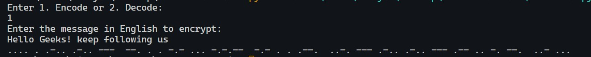
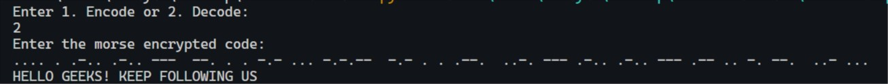

# Morse-Code
Morse encoder and decoder system in python. It is an intermediate level project but quite easy to un derstand.

### Tools and Languages


<br>

### Libraries used
This is an intermediate level project but still doesn't need any extra libraries.

### Breaking the code
```python
MORSE_CODE_DICT = { 'A':'.-', 'B':'-...', 
                    'C':'-.-.', 'D':'-..', 'E':'.', 
                    'F':'..-.', 'G':'--.', 'H':'....', 
                    'I':'..', 'J':'.---', 'K':'-.-', 
                    'L':'.-..', 'M':'--', 'N':'-.', 
                    'O':'---', 'P':'.--.', 'Q':'--.-', 
                    'R':'.-.', 'S':'...', 'T':'-', 
                    'U':'..-', 'V':'...-', 'W':'.--', 
                    'X':'-..-', 'Y':'-.--', 'Z':'--..', 
                    '1':'.----', '2':'..---', '3':'...--', 
                    '4':'....-', '5':'.....', '6':'-....', 
                    '7':'--...', '8':'---..', '9':'----.', 
                    '0':'-----', ', ':'--..--', '.':'.-.-.-', 
                    '?':'..--..', '/':'-..-.', '-':'-....-', 
                    '(':'-.--.', ')':'-.--.-'} 
```
Declaring the morse code dictionary containing morse codes for alphabets and symbols.

```python
def encrypt(message): 
    cipher = '' 
    for letter in message: 
        if letter != ' ': 
  
            # Looks up the dictionary and adds the 
            # correspponding morse code 
            # along with a space to separate 
            # morse codes for different characters 
            cipher += MORSE_CODE_DICT[letter] + ' '
        else: 
            # 1 space indicates different characters 
            # and 2 indicates different words 
            cipher += ' '
  
    return cipher 
```
This function takes the code in english and returns the morse encrypted message.

```python
def decrypt(message): 
  
    # extra space added at the end to access the 
    # last morse code 
    message += ' '
  
    decipher = '' 
    citext = '' 
    for letter in message: 
  
        # checks for space 
        if (letter != ' '): 
  
            # counter to keep track of space 
            i = 0
  
            # storing morse code of a single character 
            citext += letter 
  
        # in case of space 
        else: 
            # if i = 1 that indicates a new character 
            i += 1
  
            # if i = 2 that indicates a new word 
            if i == 2 : 
  
                 # adding space to separate words 
                decipher += ' '
            else: 
  
                # accessing the keys using their values (reverse of encryption) 
                decipher += list(MORSE_CODE_DICT.keys())[list(MORSE_CODE_DICT 
                .values()).index(citext)] 
                citext = '' 
  
    return decipher 
```
This function takes the code in morse encrypted message and returns the decrypted message in english.

```python
def main(): 
    print("Enter 1. Encode or 2. Decode: ")
    choice = int(input())
    if choice == 1:
        print("Enter the message in English to encrypt: ")
        message = input()
        result = encrypt(message.upper()) 
        print (result) 
    
    elif choice == 2:
        print("Enter the morse encrypted code: ")
        message = input()
        result = decrypt(message) 
        print (result) 

    else:
        print("Invalid choice")
        exit
# Executes the main function 
if __name__ == '__main__': 
    main() 
```
Hard-coded driver function to run the program.

### Sample Output




### Developed By:
[Ankush Mishra](https://github.com/ankush0939)


